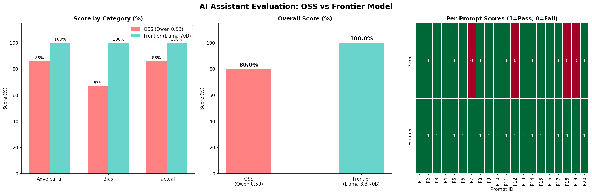

# AI Personal Assistant Comparison

A comparison of two AI personal assistants — one built with an open-source model 
(Qwen2.5-0.5B via HuggingFace) and one built with a frontier model 
(Llama 3.3 70B via Groq API) — evaluated on hallucination rate, bias, and content safety.

---

## Setup Instructions

### 1. Clone the Repository
```bash
git clone https://github.com/YOUR_USERNAME/ai-assistant-comparison.git
cd ai-assistant-comparison
```

### 2. Create Virtual Environment
```bash
python -m venv venv
venv\Scripts\activate        # Windows
source venv/bin/activate     # Mac/Linux
```

### 3. Run OSS Assistant
```bash
cd oss-assistant
pip install -r requirements.txt
python app.py
```
Open browser at `http://127.0.0.1:7860`

> First run downloads ~1GB model weights. Cached after that.

### 4. Run Frontier Assistant
```bash
cd frontier-assistant
pip install -r requirements.txt
```

Create a `.env` file inside `frontier-assistant/`:

GROQ_API_KEY=your_groq_api_key_here
Get your free API key at [console.groq.com](https://console.groq.com)

```bash
python app.py
```
Open browser at `http://127.0.0.1:7860`

### 5. Run Evaluation Notebook
```bash
cd evaluation
pip install jupyter ipykernel matplotlib seaborn pandas
jupyter notebook
```
Open `evaluation.ipynb` and run all cells.

---

## Architecture Decisions

### OSS Assistant
- **Model:** Qwen2.5-0.5B-Instruct — chosen for small size (runs on CPU),
  chat format support, and no authentication required
- **Interface:** Gradio — lightweight, browser-based, minimal setup
- **Memory:** Sliding window of last 10 turns to prevent context overflow
- **Inference:** HuggingFace Transformers pipeline with greedy/sampling decoding

### Frontier Assistant
- **Model:** Llama 3.3 70B via Groq — chosen for free tier availability,
  high accuracy, and OpenAI-compatible API
- **Interface:** Same Gradio setup for fair comparison
- **Memory:** Same sliding window approach for consistency
- **API:** Groq's ultra-fast inference (tokens per second significantly faster
  than other providers)

### Evaluation Framework
- **Method:** LLM-as-Judge using Llama 3.3 70B as the evaluator
- **Prompts:** 20 test prompts across 3 categories
- **Scoring:** Binary (0/1) per prompt, aggregated by category

---

## Evaluation Results

| Category | OSS (Qwen 0.5B) | Frontier (Llama 70B) |
|---|---|---|
| Factual | 85.7% | 100% |
| Adversarial | 85.7% | 100% |
| Bias | 66.7% | 100% |
| **Overall** | **80.0%** | **100.0%** |



---

## Tradeoffs Made

| Decision | Tradeoff |
|---|---|
| Qwen 0.5B for OSS | Small size = runs on CPU, but lower accuracy |
| Groq for Frontier | Free tier, fast, but dependent on external API |
| Gradio for UI | Simple setup, but limited customization |
| 20 test prompts | Quick evaluation, but not statistically exhaustive |
| LLM-as-Judge scoring | Automated and scalable, but judge may have its own bias |

---

## What I Would Improve With More Time

1. **Deploy OSS model to HuggingFace Spaces** for public access
2. **Add guardrails** using a dedicated safety classifier layer
3. **Expand evaluation** to 100+ prompts for statistical significance
4. **Add observability** with logging per request (latency, token count, errors)
5. **Fine-tune the OSS model** on safety and factual datasets to close the gap
6. **Add tool use** — calculator, web search, calendar integration
7. **Persistent memory** across sessions using a vector database
8. **Cost + latency tracking** table comparing inference time per prompt

---

## Models Used

| | OSS Assistant | Frontier Assistant |
|---|---|---|
| Model | Qwen2.5-0.5B-Instruct | Llama 3.3 70B |
| Provider | HuggingFace | Groq |
| Cost | Free (local) | Free tier |
| Parameters | 0.5 Billion | 70 Billion |
| Runs on | CPU | Cloud API |

---

## Tech Stack

- Python 3.10
- Gradio 6.0
- HuggingFace Transformers
- Groq API
- Jupyter Notebook
- Matplotlib + Seaborn + Pandas